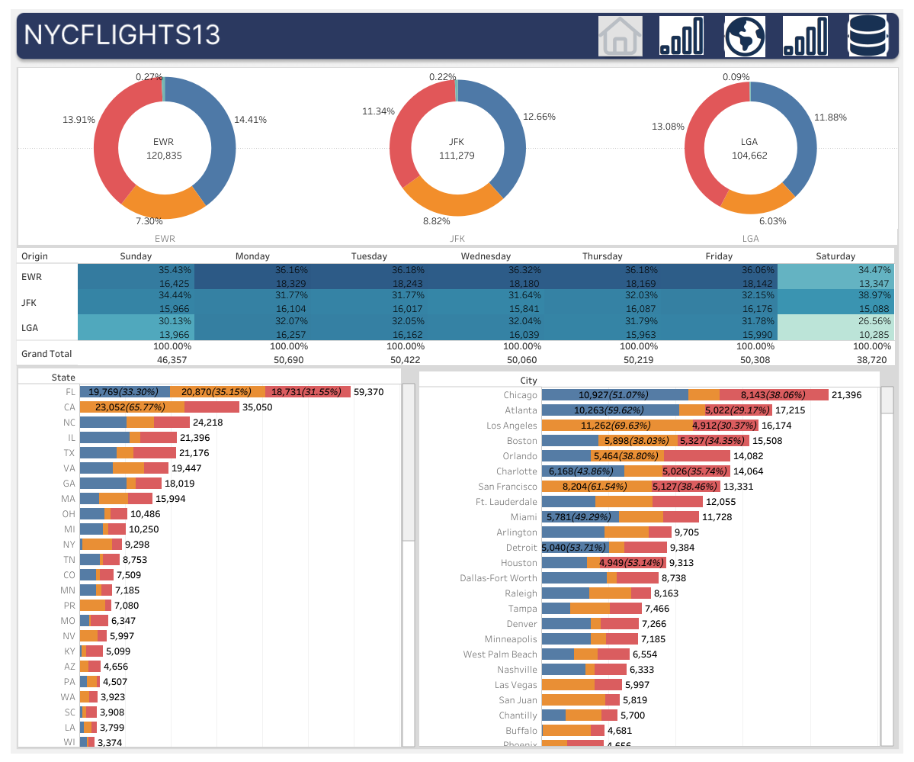
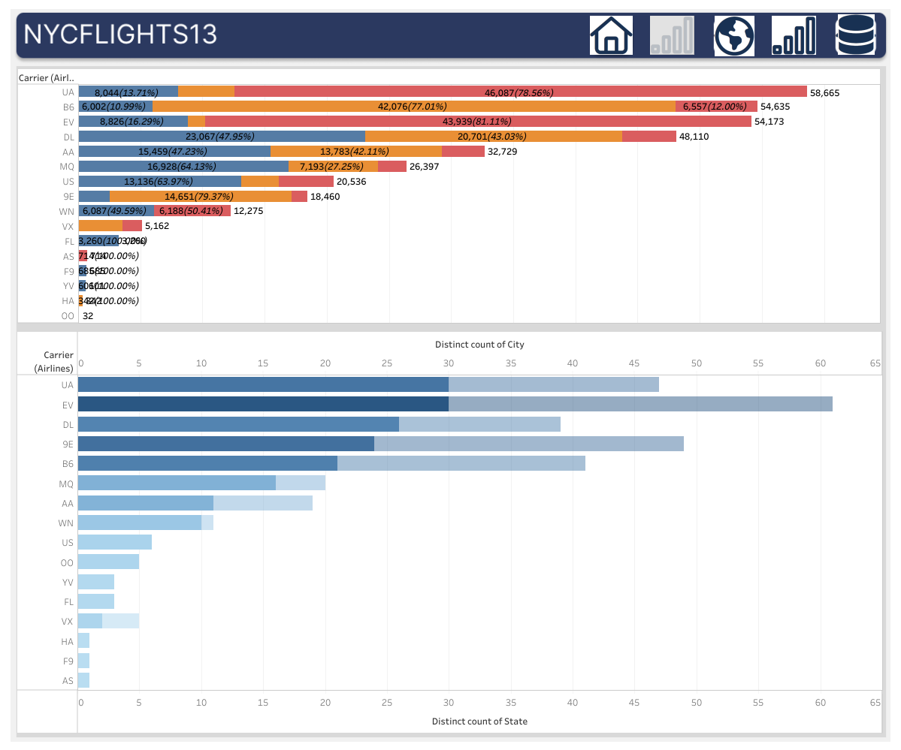
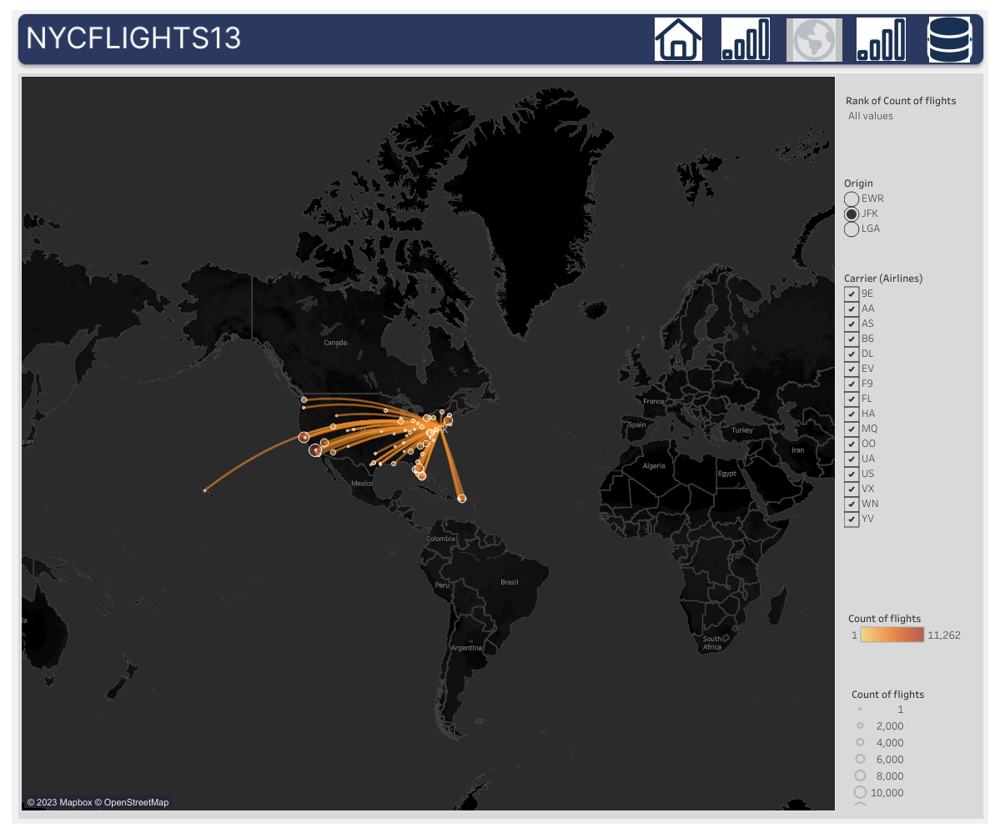

```{r setup, include=FALSE}
knitr::opts_chunk$set(echo = TRUE)
```


# **Dashboard 1** 

## Describtive Stats
<a href = "https://public.tableau.com/app/profile/seyma.kalay/viz/Destination_Map/Dsh1">
```{r echo=FALSE,fig.cap="**Figura 1:** Dsh1", out.width='100%', fig.align='left'}

```
</a>


* Total number of flight `EWR = 120.835, JFK = 111,279,` and `LGA = 104,662`

* Most of the people prefer to travel in the morning/afternoon during the week days

* Top destination **states:** `FL, CA, NC` and **cities:** `Chicago, Atlanta, Los Angeles`


# **Dashboard 2** 

# Describtive Stats
<a href = "https://public.tableau.com/app/profile/seyma.kalay/viz/Destination_Map/Dsh2">
```{r echo=FALSE,fig.cap="**Figura 2:** Dsh2", out.width='100%', fig.align='left'}

```
</a>


* Top carries with the highest number of flights: `UA, B6,` and `EV`.

* Carries UA, EV and DL flights 30, 30, and 26 distincts of countries and 47, 47, 37 cities, respectively.


# **Dashboard 3** 

## Map
<a href = "https://public.tableau.com/app/profile/seyma.kalay/viz/Destination_Map/Dsh3">
```{r echo=FALSE,fig.cap="**Figura 3:** Dsh3", out.width='100%', fig.align='left'}

```
</a>


# **Dashboard 4** 

## Stats
<a href = "https://public.tableau.com/app/profile/seyma.kalay/viz/Destination_Map/Dsh4">
```{r echo=FALSE,fig.cap="**Figura 4:** Dsh4", out.width='100%', fig.align='left'}

```
</a>


Download <u><a href="./ReportPdf.pdf" target="_blank"> report </a></u>.


