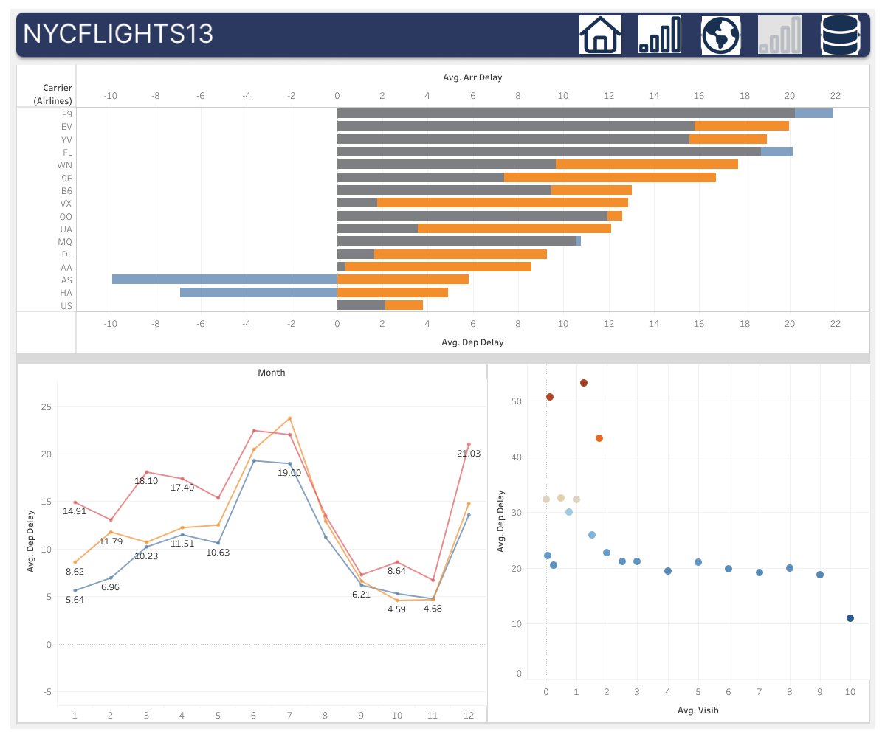

```{r setup, include=FALSE}
knitr::opts_chunk$set(echo = TRUE)
```


## **Dashboard 1** 
#### [Describtive Stats](https://public.tableau.com/app/profile/seyma.kalay/viz/Destination_Map/Dsh1)


```{r echo=FALSE,fig.cap="Dsh1", out.width='100%', fig.align='left'}
knitr::include_graphics('images/Dsh1.png')
```


* Il Numero totale di volo `EWR = 120.835, JFK = 111,279,` e `LGA = 104,662`,

* La maggior parte delle persone preferisce viaggiare al mattino/pomeriggio durante i giorni feriali,

* La destinazione principale **Stati:** `FL, CA, NC` e **Citte:** `Chicago, Atlanta, Los Angeles`.


\newpage
## **Dashboard 2** 

#### [Describtive Stats](https://public.tableau.com/app/profile/seyma.kalay/viz/Destination_Map/Dsh2)

```{r echo=FALSE,fig.cap="Dsh2", out.width='100%', fig.align='left'}
knitr::include_graphics('images/Dsh2.png')
```


* I top carries con il maggior numero di voli: `UA, B6,` e `EV`,

* Carries UA, EV e DL voli 30, 30, e 26 paesi distinto e 47, 47, 37 citte distinte, rispettivamente.

\newpage

## **Dashboard 3** 

#### Map [Map](https://public.tableau.com/app/profile/seyma.kalay/viz/Destination_Map/Dsh3)

```{r echo=FALSE,fig.cap="Dsh3", out.width='100%', fig.align='left'}
knitr::include_graphics('images/Dsh3.png')
```


* Sono stati filtrati solo i valori rilevanti.
 


\newpage
## **Dashboard 4** 

#### [Stats](https://public.tableau.com/app/profile/seyma.kalay/viz/Destination_Map/Dsh4")

```{r echo=FALSE,fig.cap="Dsh4", out.width='100%', fig.align='left'}

```

* I vettori F9, EV e YV hanno ritardi di partenza più elevati,

* Il ritardo della partenza è massimo durante l'estate e durante le vacanze di Natale,

* Il ritardo medio alla partenza può essere aumentato se la visibilità in miglia è inferiore a 2 miglia all'ora.


