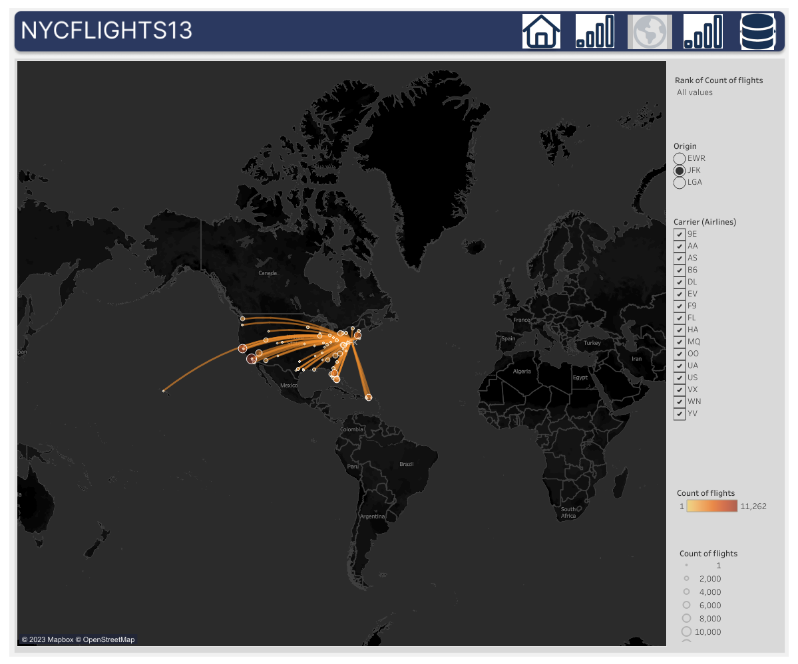

```{r setup, include=FALSE}
knitr::opts_chunk$set(echo = TRUE)
```


## **Dashboard 1** 
#### [Describtive Stats](https://public.tableau.com/app/profile/seyma.kalay/viz/Destination_Map/Dsh1)


```{r echo=FALSE,fig.cap="Dsh1", out.width='100%', fig.align='left'}
knitr::include_graphics('images/Dsh1.png')
```


* Total number of flight `EWR = 120.835, JFK = 111,279,` and `LGA = 104,662`

* Most of the people prefer to travel in the morning/afternoon during the week days

* Top destination **states:** `FL, CA, NC` and **cities:** `Chicago, Atlanta, Los Angeles`


\newpage
## **Dashboard 2** 

#### [Describtive Stats](https://public.tableau.com/app/profile/seyma.kalay/viz/Destination_Map/Dsh2)

```{r echo=FALSE,fig.cap="Dsh2", out.width='100%', fig.align='left'}
knitr::include_graphics('images/Dsh2.png')
```


* Top carries with the highest number of flights: `UA, B6,` and `EV`.

* Carries UA, EV and DL flights 30, 30, and 26 distincts of countries and 47, 47, 37 cities, respectively.

\newpage

## **Dashboard 3** 

#### Map [Map](https://public.tableau.com/app/profile/seyma.kalay/viz/Destination_Map/Dsh3)

```{r echo=FALSE,fig.cap="Dsh3", out.width='100%', fig.align='left'}

```


\newpage
## **Dashboard 4** 

#### [Stats](https://public.tableau.com/app/profile/seyma.kalay/viz/Destination_Map/Dsh4")

```{r echo=FALSE,fig.cap="Dsh4", out.width='100%', fig.align='left'}

```


