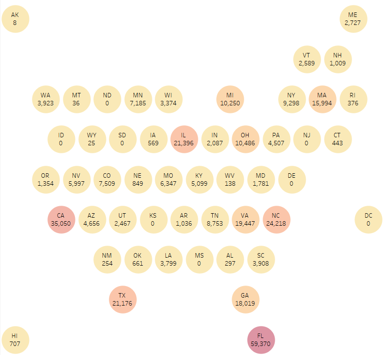

```{r setup, include=FALSE}
knitr::opts_chunk$set(echo = TRUE)
```

 
```{css float-figure-caption, echo = FALSE}
div.figure {
  display: table;
  float: right;
  padding-left: 50px;
  padding-bottom: 10px;
}
div.figure p {
  display: table-caption;
  caption-side: bottom;
  padding-left: 50px;
}
```


### **Data Set** 


* Data source  [nycflights13](https://github.com/tidyverse/nycflights13) Versione 1.0.2.

<!--  * Descrizione Dati sulla puntualità della compagnia aerea per tutti i voli in partenza da New York nel 2013.
Include anche utili "metadati" su compagnie aeree, aeroporti, meteo e aerei.
-->

<!-- -->

```{r echo=FALSE,fig.cap="**Figura 1:**[ Voli frequenti.](https://public.tableau.com/app/profile/seyma.kalay/viz/HexMap_16738875620310/HexMap2)", out.width='500px', fig.align='left'}

```


### **Overview**

Questo pacchetto contiene informazioni su tutti i voli partiti da New York (ad es. EWR, JFK e LGA) verso destinazioni negli Stati Uniti, Porto Rico e Isole Vergini Americane) nel 2013:  328.521 voli `(336.776-8255 hanno cancellato)` in totale. 
Per aiutare a capire cosa causa i ritardi, include anche una serie di altri set di dati utili.


Questo pacchetto fornisce le seguenti tabelle di dati.

* voli: tutti i voli partiti da New York nel 2013
* meteo: dati metereologici orari per ogni aeroporto
* aerei: informazioni sulla costruzione di ogni aereo
* aeroporti: nomi e località degli aeroporti


---

Last compiled: `r Sys.Date()`
