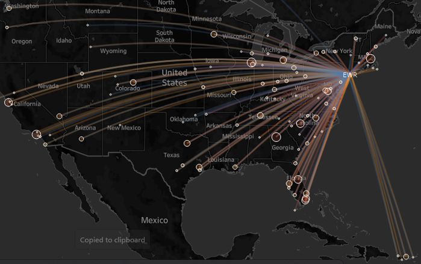

```{r setup, include=FALSE}
knitr::opts_chunk$set(echo = TRUE)
```

 
```{css float-figure-caption, echo = FALSE}
div.figure {
  display: table;
  float: right;
  padding-left: 50px;
  padding-bottom: 10px;
}
div.figure p {
  display: table-caption;
  caption-side: bottom;
  padding-left: 50px;
}
```


### **Data Set** 


* Data source  [nycflights13](https://github.com/tidyverse/nycflights13) Versione 1.0.2

* Descrizione Dati sulla puntualità della compagnia aerea per tutti i voli in partenza da New York nel 2013.
Include anche utili "metadati" su compagnie aeree, aeroporti, meteo e aerei.


```{r echo=FALSE,fig.cap="**Figura 1:**. Le partenze da EWR, JFK e LGA sono state dimostrate.", out.width='450px', fig.align='right'}

```


### **Overview**

Questo pacchetto contiene informazioni su tutti i voli partiti da New York (ad es. EWR, JFK e LGA) verso destinazioni negli Stati Uniti, Porto Rico e Isole Vergini Americane) nel 2013: 336.776 voli in totale. Per aiutare a capire cosa causa i ritardi, include anche una serie di altri set di dati utili.

Questo pacchetto fornisce le seguenti tabelle di dati.

* voli: tutti i voli partiti da New York nel 2013
* meteo: dati metereologici orari per ogni aeroporto
* aerei: informazioni sulla costruzione di ogni aereo
* aeroporti: nomi e località degli aeroporti
* compagnie aeree: traduzione tra codici e nomi di due vettori di lettere
Se sei interessato ad altri sottoinsiemi di dati di volo, consulta:

nycflights per i voli in partenza da New York nell'ultimo anno.

anyflights per i voli in partenza da qualsiasi aeroporto in qualsiasi anno.

compagnie aeree per mantenere un database SQL locale di tutti i dati di partenza dei voli.

---

Last compiled: `r Sys.Date()`
